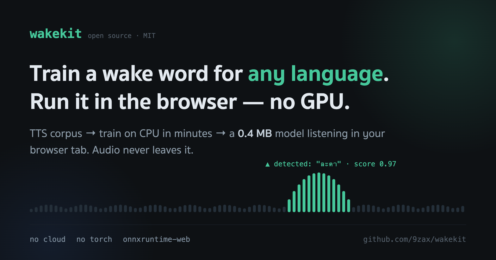

# wakekit 🌼



[](https://github.com/9zax/wakekit)
[](https://www.npmjs.com/package/wakekit)

## 🎙️ [**Live demo**](https://wakekit.vercel.app)

**Train a wake word for any language with TTS, run it in the browser.**
No GPU, no torch, no cloud — three small ONNX models on a worker thread.

Browser ports of [openWakeWord](https://github.com/dscripka/openWakeWord)'s *runtime* already
exist. What didn't exist is the rest: openWakeWord's sample generator ships one English TTS
checkpoint, so training a wake word in Thai — or anything else — was off the table. wakekit is the
whole pipeline:

- **Runtime** — streaming detection in a Web Worker on `onnxruntime-web` (wasm, single-threaded:
  works on any static host, no cross-origin isolation). Audio never leaves the tab.
- **Training** — TTS corpus generation for *your* language, a numpy-only trainer (~110k params,
  CPU, minutes), and an eval harness that reports the two numbers that matter: recall and false
  fires per minute.
- **Model zoo** — every wake word is one ~0.4 MB head + one manifest entry. Shipped today:
  **ละดา** (Thai) and **จาร์วิส** (jarvis, Thai), trained end-to-end with this repo. Next: อีดี, yours.

## Try it

**Live demo:** [wakekit.vercel.app](https://wakekit.vercel.app) — pick a wake word, press start, say it.

Or run locally:

```bash
npm install
npm run dev        # → http://localhost:5173 — pick a wake word, press start, say it
```

The test page shows the live score trace, per-model thresholds, detections, and everything on this
page — picker included — is driven by `models/manifest.json`.

## macOS app

A menu-bar voice assistant built on the same engine: always-listening wake word, Thai dictation,
and voice commands ("เปิดเพลง …" opens a YouTube search; add your own commands in the tray —
pipe to `claude -p`, search Chrome, or search YouTube). Apple Silicon only.

```sh
brew install --cask 9zax/tap/wakekit
```

Ad-hoc signed — if macOS refuses the first launch:
`xattr -dr com.apple.quarantine /Applications/WakeKit.app`.
The flower in the menu bar is the state: green = listening, red = stopped.

Build from source: `npm install && npm run app:build` (needs Rust + Xcode CLT; the STT sidecar
and app icons build automatically).

## Use the library

```bash
npm install wakekit
```

The package ships the models too (`node_modules/wakekit/models/`) — copy them into your app's
static dir, or skip hosting entirely and point `base` at the CDN:
`https://cdn.jsdelivr.net/npm/wakekit/models/`. Also serve
`ort-wasm-simd-threaded.{mjs,wasm}` from `node_modules/onnxruntime-web/dist/` (see
`vite.config.ts` for the dev-server/build recipe).

```ts
import { WakeKit, listenMic, loadManifest } from 'wakekit';

const models = await loadManifest('/models/');

const kit = await WakeKit.load({
  model: models.find((m) => m.id === 'lada')!,
  base: '/models/',                       // where the .onnx files are served
  onHit: (score) => console.log('wake word heard!', score),
});

const stop = await listenMic(kit);        // mic → detector, all local
// later: stop(); kit.dispose();
```

No mic helper needed? Feed audio from any source: `kit.push(float32Samples, sampleRate)` —
resampling to 16 kHz is handled. `kit.configure({ threshold })` retunes live.

A detection means "the wake word was spoken" — nothing more. Whether your assistant should
*respond* (vs. the word merely occurring mid-conversation) is an app-level decision; gate it with
your own logic.

## Wake words

| id | label | lang | threshold | trained on |
|---|---|---|---|---|
| `lada` | ละดา | th | 0.95 | synthetic Thai voices — held-out: recall 100%, 0 false fires |
| `jarvis` | จาร์วิส | th | 0.95 | synthetic Thai voices — held-out: recall 100%, 0 false fires |

Adding one is a `.onnx` file plus one `models/manifest.json` entry — the demo and the library pick
it up with no code change. **The threshold travels with the model**, because each head puts its
positives and negatives in a different place; ship the number you measured, not a global constant.

## Train your own — any language

```bash
make help          # the pipeline, documented
make train-lada    # the worked example, end to end
```

Four steps: TTS corpus (positives + *rhyming trap words* in your language + everyday speech) →
featurize → train (numpy) → measure on held-out voices. Full guide with the ละดา case study:
[docs/training.md](docs/training.md).

Honest caveat: TTS evals prove the chain and unseen-speaker recall; they cannot predict false
fires per hour in a real noisy room. Collect real captures, feed them back, retrain — the scripts
support that loop.

## Beyond the browser

The models are plain ONNX — the same three files run under any ONNX Runtime binding. Worked
examples in Python, Node.js, Rust, Go, C#, Java, C++, and Swift:
[docs/other-languages.md](docs/other-languages.md).

## How it works

```
mic (any rate) ──resample──► 16 kHz f32 ──► melspectrogram.onnx   (frozen)
                                        ──► embedding_model.onnx  (frozen, Google speech-embedding)
                                        ──► <word>.onnx           (trained head, ~0.4 MB)
                                        ──► score every 80 ms ──► hit when ≥ threshold
```

`npm run selfcheck` drives the real worker over the real models and asserts labelled clips when
present (`eval/clips/pos_*.wav` must fire, `neg_*.wav` must not).

## Credits & license

Apache-2.0 (see [LICENSE](LICENSE), [NOTICE](NOTICE)) — free to use, modify, and redistribute,
including commercially.

| component | author / source | license |
|---|---|---|
| [openWakeWord](https://github.com/dscripka/openWakeWord) — feature pipeline + frozen `melspectrogram.onnx` | David Scripka | Apache-2.0 |
| `embedding_model.onnx` — derived from [Google speech-embedding](https://tfhub.dev/google/speech_embedding/1) | Google | Apache-2.0 |
| [ONNX Runtime Web](https://onnxruntime.ai/) — wasm inference | Microsoft | MIT |
| [highlight.js](https://highlightjs.org/) — demo code highlighting | highlight.js contributors | BSD-3-Clause |
| [thinking-orbs](https://www.npmjs.com/package/thinking-orbs) — demo wake-pill orb | | MIT |
| Trained heads (`models/<word>.onnx`) — synthetic speech (TTS) | wakekit | Apache-2.0 |
