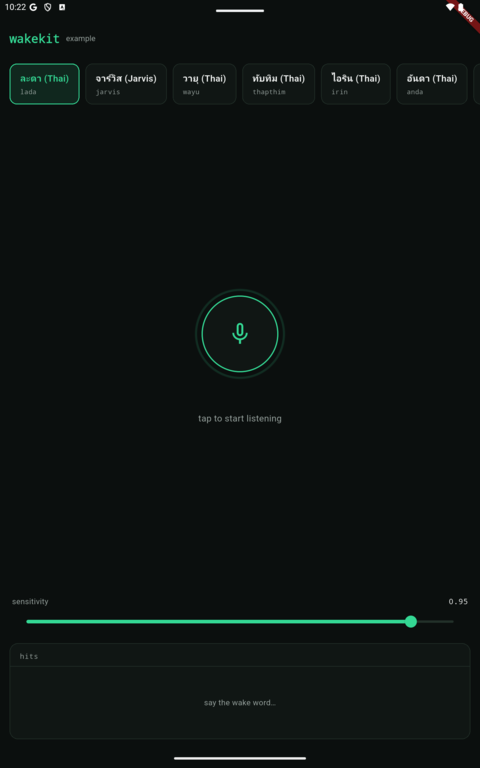

# wakekit example



Minimal cousin of the [live demo](https://wakekit.vercel.app): pick a wake word
from the bundled manifest, start/stop the mic, watch the live score, hit list,
and observed step interval (should hover near 80 ms at a true 16 kHz feed).

```sh
cd example
flutter run            # on an iOS / Android device, or -d windows / -d linux
```

The `macos/` runner here is NOT a supported target of the package — it exists
only so `scripts/flutter-parity.sh` can run the score-parity integration test
on a Mac dev machine.

Depends on the parent package by path. Pending manifest entries render disabled.
See the package README for platform floors (mic permission strings, minSdk,
static linkage, …).
